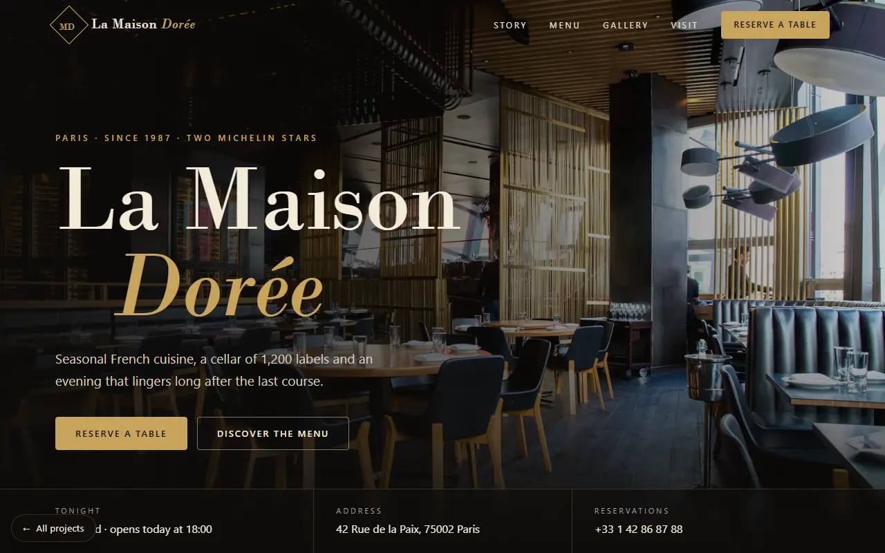

# Websites Preview — web design & development by Hamza Ben Ismail

Fourteen complete, working websites for different industries — restaurants, hotels, clinics, car rental, gyms,
travel, salons, shops, real estate, events, logistics, SaaS and personal brands — plus a landing page to browse
them. Every site is built with **pure HTML, CSS and vanilla JavaScript**: no frameworks, no build step, and
**no external requests**, so each one works offline straight from disk and loads fast on phones.

**Live:** <https://websites-preview.netlify.app>



## The projects

| # | Site | Industry | Highlights |
|---|---|---|---|
| 1 | [La Maison Dorée](restaurant-website/) | Fine dining | Reservations that respect opening hours and notice rules, live “open now” indicator, menu tabs, gallery lightbox |
| 2 | [Ember & Oak](digital-menu/) | QR restaurant menu | Search, dietary filters, order by table with running total, EN / FR / AR (right-to-left), printable table QR code generated in the page |
| 3 | [Sarah & James](wedding-invitation/) | Wedding | Countdown, story timeline, schedule, RSVP per guest with meal choices, “add to calendar” (.ics) |
| 4 | [LUXE](ecommerce-store/) | Fashion e-commerce | Filters and sort, quick view with variants, cart and wishlist saved locally, promo codes, 4-step checkout with card validation |
| 5 | [PrimeNest Realty](real-estate-website/) | Real estate | Buy/rent search, favourites, compare up to 3 homes, photo lightbox, mortgage calculator, shareable listing links |
| 6 | [SwiftDrop](delivery-website/) | Delivery & logistics | Instant quote across 29 Tunisian cities, live tracking simulation, coverage checker, business plans |
| 7 | [The Azure Palace](hotel-website/) | Luxury hotel | Booking widget with availability calendar, live price with taxes and offer codes, room galleries, reviews |
| 8 | [StockPulse](inventory-dashboard/) | Inventory SaaS | A working mini-app: products CRUD, stock movements, low-stock alerts, hand-drawn charts, CSV import/export, dark mode |
| 9 | [Alex Rivera](portfolio-resume/) | Personal brand | Project filters and case studies, contact form, and a one-page printable résumé mode |
| 10 | [Nour Clinic](clinic-website/) | Dental & medical clinic | Book by doctor, day and time slot from each doctor’s weekly schedule (no double-booking), confirmation with reference and “add to calendar” (.ics), prices in DT, live “open now” hours, 24/7 emergency line |
| 11 | [Yalla Drive](car-rental-website/) | Car rental | Search by office and dates with opening-hours checks, fleet filters and sort, car galleries, live price with weekend and long-rental discounts, extras and one-way fees, driver checks (+216, age, licence) |
| 12 | [FORGE Fitness](gym-website/) | Fitness studio | Weekly class timetable with filters and live spots left (book/cancel, full classes locked), monthly/yearly plans, BMI + Mifflin–St Jeor calorie and macro calculator, coach profiles, free-trial form |
| 13 | [Maison Lina](salon-website/) | Barber & beauty salon | Book stylist → services → time, only offering slots long enough for everything chosen, printable price list, loyalty stamp card, gift-card builder with live preview, gallery lightbox |
| 14 | [Rihla Tours](travel-agency-website/) | Tunisian tour operator | Tour filters and sort, day-by-day itineraries with photo lightbox, price calculator with seasons, group discounts, private option and single rooms, month-by-month season chart, enquiry form |

Open [`index.html`](index.html) to browse them all, filter by industry, and preview any site at desktop or
phone size.

## What every site includes

- **Responsive** — designed for phones, tablets and desktops (tested at 390, 768 and 1440 px, no horizontal scroll)
- **Works offline** — all images, fonts and scripts are local; nothing is loaded from other servers
- **Fast** — optimised WebP images with responsive sizes, lazy loading, no frameworks
- **Accessible** — semantic HTML, keyboard navigation, visible focus, reduced-motion support
- **Real features** — forms validate and confirm (data is stored in the browser, since these are demos without a backend)

## Run it

No installation needed: open `index.html` in a browser. Or serve the folder with any static server, for example:

```bash
npx http-server . -p 8080
```

## Project structure

```
index.html, assets/          # landing page (styles, script, font)
previews/                    # thumbnail of each site for the landing page
<site>/index.html            # each site: its page …
<site>/assets/css|js|img|fonts   # … and its own styles, scripts, images and font
```

## Credits

- Photos from [Unsplash](https://unsplash.com) (Unsplash License), stored locally as optimised WebP.
- Fonts are open-source (SIL Open Font License); each font folder includes its licence file.
- All brands, people and listings in the demos are fictional.

---

Designed and built by **Hamza Ben Ismail** — [portfolio](https://www.hamzabenismail.cloud-ip.cc) ·
[GitHub](https://github.com/naniiic137) · hamza.benismail.6@gmail.com
